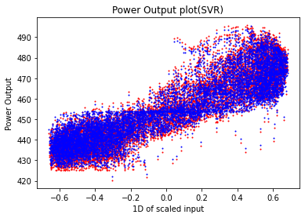

# Energy Prediction of a Comibined Cycle Power Plant

## Data preporcessing
### 1. Import the libraries


```python
import pandas as pd
import numpy as np
import matplotlib.pyplot as plt
from sklearn.preprocessing import StandardScaler
from sklearn.svm import SVR
```

### 2. Read the excel file


```python
dataset=pd.read_excel("./CCPP dataset/Folds5x2_pp.xlsx",sheet_name = None)
```

### 3. Preparing the Training and Test Data

#### In this project we take the first four excel sheet data as the training data and the last sheet as the test data


```python
def getdata(dataframe):
    X = dataframe.iloc[:, :-1]
    y = dataframe.iloc[:, -1]
    return X,y

X_train = pd.DataFrame()
y_train = pd.DataFrame()
```

#### Train Data:


```python
for i in range(1,5):
    sheet_no = "Sheet"+str(i)
    X_temp,y_temp = getdata(dataset[sheet_no])
    X_train = pd.concat([X_train,X_temp],axis = 0)
    y_train = pd.concat([y_train,y_temp])


X_train = X_train.values
y_train = y_train.values
y_train = y_train.reshape(len(y_train),1)
```

#### Test Data:


```python
X_test = dataset["Sheet5"].iloc[:, :-1].values
y_test = dataset["Sheet5"].iloc[:, -1].values
y_test = y_test.reshape(len(y_test),1)
```

## Data Normalization
### In this Project we employ the use of Standard Scaler library to bring the data to  mean and unity variance.


```python
sc_X = StandardScaler()
sc_y = StandardScaler()
X_train = sc_X.fit_transform(X_train)
y_train = sc_y.fit_transform(y_train)
```

## Model building
#### In this project we use the RBF SVM Kernel to model our predictor


```python
from sklearn.svm import SVR
regressor = SVR(kernel = 'rbf',C=10,gamma=100.0,verbose=True)
regressor.fit(X_train, y_train)
```

    c:\users\hp\pycharmprojects\pythonproject\venv\lib\site-packages\sklearn\utils\validation.py:1143: DataConversionWarning: A column-vector y was passed when a 1d array was expected. Please change the shape of y to (n_samples, ), for example using ravel().
      y = column_or_1d(y, warn=True)
    

    [LibSVM]


### Prediction of Test Set Results


```python
y_pred = sc_y.inverse_transform(regressor.predict(sc_X.transform(X_test)).reshape(len(y_test),1))
np.set_printoptions(precision=2)
print(np.concatenate((y_pred.reshape(len(y_pred),1), y_test.reshape(len(y_test),1)),1))
```

    [[478.77 480.48]
     [447.46 445.75]
     [440.47 438.76]
     ...
     [464.25 465.96]
     [452.64 450.93]
     [453.35 451.67]]
    

### Evaluating Model Performance
#### We evaluate the model performance based on the accuracy and the R2 score of the model


```python
from sklearn.metrics import r2_score, mean_squared_error
print(r2_score(y_test, y_pred))
print(mean_squared_error(y_test, y_pred))
```

    0.9909044308083992
    2.649101580674778
    

### Visualizing the results
#### Applying PCA to reduce the features to one dimension


```python
# Applying Kernel PCA
from sklearn.decomposition import KernelPCA
kpca = KernelPCA(n_components = 1, kernel = 'rbf')
X_test = kpca.fit_transform(sc_X.transform(X_test))

```

#### Plotting y_test and y_pred in Matplotlib


```python
#Visualising the Multiple Linear regression results
plt.scatter(X_test,y_test, color = 'red',s=1)
plt.scatter(X_test,y_pred, color = 'blue',s=1)
plt.title('Power Output plot(SVR)')
plt.xlabel('1D of scaled input')
plt.ylabel('Power Output')
plt.show()
```


    

    

